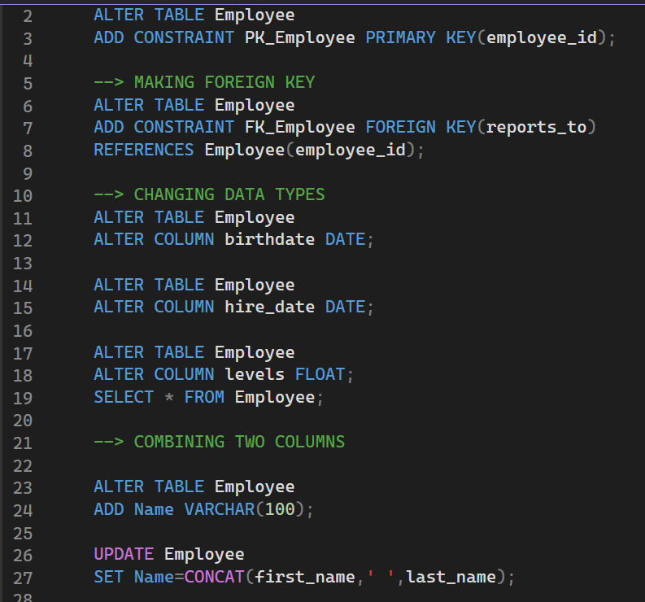
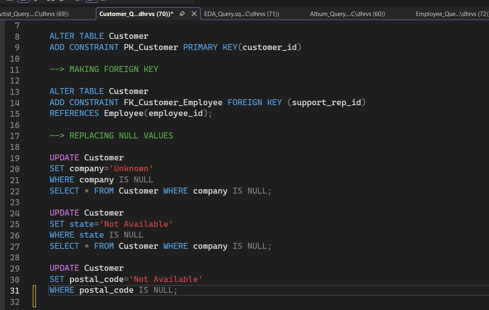
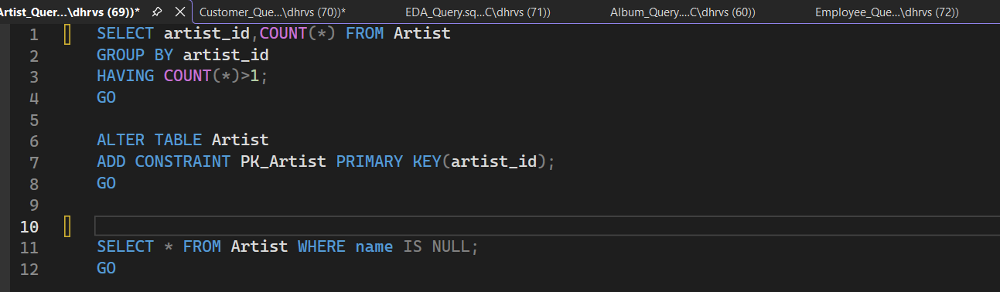
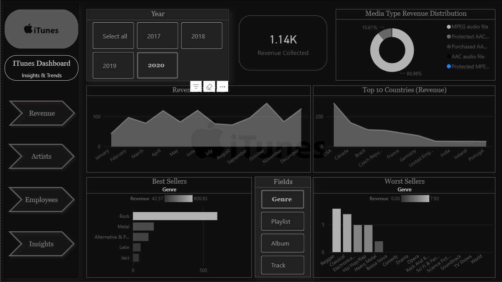
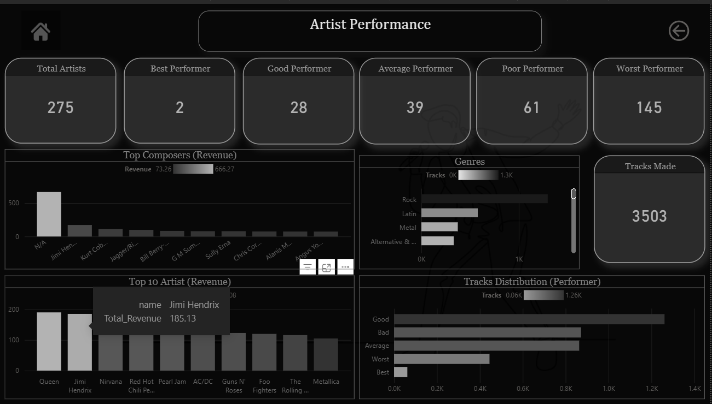
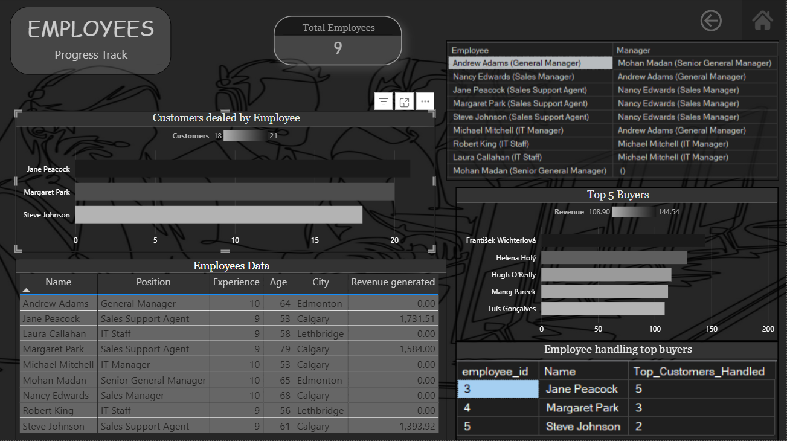
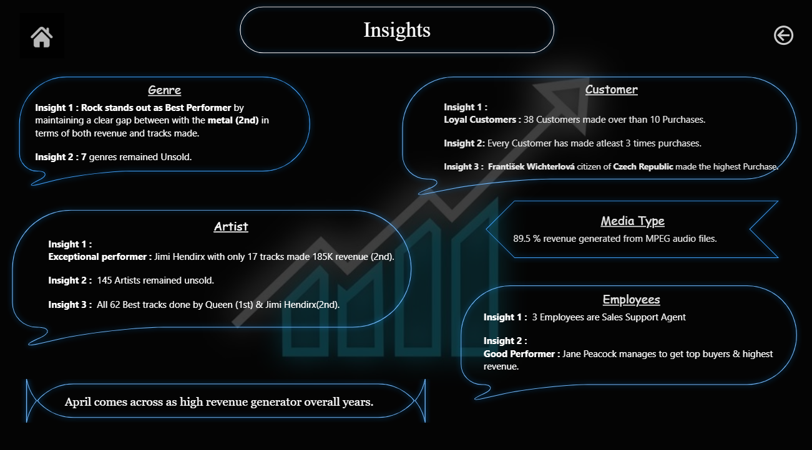

# 🎶 Itunes_Dashboard-Insights-Trends
This Project focuses on analyzing ITunes data using SQL and Power BI to uncover insights on customer behavior, Artist &amp; Sales performance, and music trends through interactive dashboards.

 

## 📌 Problem Statement
Apple iTunes maintains a large digital music store with millions of tracks ,thousands of customers worldwide and a network of employees managing sales operations,as the business expands,the leadership team is looking to gain deeper insights into customer behavior,music preferences and overall sales performance.

 

## 📚 Dataset 
- Data : [Dataset](ITUNES_Analysis/1_Itunes_Raw_Dataset)
  - Apple ITunes Music (2017 - 2020).
  - 11 Tables (album,artist,customer,employee,genre,invoice,invoice_line,media_type,playlist,playlist_track,track).
- Source : Kaggle

 

## 🧹 Data Cleaning & Preparation 
- Handled Duplicate & Null Values from all tables.
- Changed Data Types of required fields.
- Enforced Primary Key & Foreign Key to make relationship between tables.

  ### [SQL Queries](ITUNES_Analysis/2_SQLQueries)

### 🖼 Screenshots of some Important Queries
  #### Click on them to see clearly

 

## 📈 Exploratory Data Analysis (EDA) 
- 2019 generated highest revenue.
- 89.5% revenue is from MP3 audio files.
- Rock Genre generates 2.6k revenue.
- Total Artists are 275.
- Total Tracks made are 3503.
- There are 3 Sales Supoort Agent.
- #### Employees:
  - Mohan Madan (Senior General Manager)
  - Andrew Adams (General Manager)
  - Nancy Edwards (Sales Manager)
  - Jane Peacock (Sales Support Agent)
  - Margaret Park (Sales Support Agent)
  - Steve Johnson (Sales Support Agent)
  - Michael Mitchell (IT Manager)
  - Robert King (IT Staff)
  - Laura Callahan (IT Staff) 

 

## 🏨 Dashboard / Visualization
  #### Click on Images to go in folder.

  
  

  

#### DAX Used
- Made Field Parameter for dynamically changing between Genres,Playlist,Album,Track Revenue.
- Key Measures:
  - Dynamic_Top_Rank
  - Dynamic_Bottom_Rank
  - Top & Bottom 5 Filter
  - Categorizing Good,Bad,Worst & Best Performers based on revenue.

### [Dasboard File](ITUNES_Analysis/Itunes_Analysis_Dashboard.pbix)

 

## 🎯 Insights 
  ### All Insights are described in this image.

### Only these 3 handles with customer :
- Jane Peacock (Sales Support Agent)
- Margaret Park (Sales Support Agent)
- Steve Johnson (Sales Support Agent)

 

## 🗣 Recommendations :
- Provide more projects to Jimi Hendrix,She has potential to give high revenue.
- Assign more customers to Jane Peacock,brings up high buyer customer.
- Donot go further with genres and artists who didn't made any sales.

 

## ⚙ Tech Stack & 🛠 Tools Stack :
- SQL - (SSMS) SQl Sever Management Studio 
- PowerBI - Microsoft Power BI

## Contact - Dhruv Sikarwar (Author)
- [Connect With me on LinkedIn](https://www.linkedin.com/in/dhruv-sikarwar-b2477a30b)
